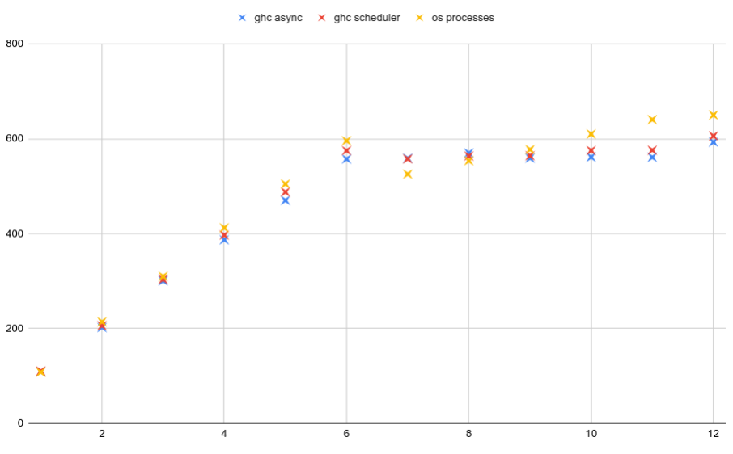

# Benchmarking the speed-up for concurrent Haskell

## Building and running the program

Using nix/cabal

    $ nix-shell --attr env
    $ cabal build
    $ head -n 100000 < hyphenated.txt > hyphenated-h100000.txt
    $ cabal run --ghc-options="-threaded" ghc-concurrency-speedup -- -a hyphenated-h10000.txt +RTS -N2

Using stack

    $ stack build
    $ stack exec ghc-concurrency-speedup -- -a hyphenated-10000.txt

I don't know how to tell stack to compile and run with `-threaded` like
above with cabal.
It's possible to add ghc options via `stack.yaml` but be aware that
I compile without `-threaded` for the *OS processes benchmark*.

## Run benchmarks

There are .sh files to run benchmarks.
They are meant to be called from within the nix shell:

    $ nix-shell --attr env

GHC threads using the `async` library:

    $ ./pperformance.sh 12 -a

GHC threads using the `scheduler` library:

    $ ./pperformance.sh 12 -s

Single-threaded ghc, but parallelism by means of OS threads:

    $ ./pperformance-osprocesses.sh 12

Theses scripts all run the dummy function first on a list of 10,000 words,
then on a list of 100,000 words.
I use the shorter list to get quick feedback, but I only plot and compare
the results of the 100,000-words-list.

## Benchmarking results

OS processes perform better than GHC threads.
That warrants some explanation.
The task that is run in parallel is a pure dummy computation on a list of
`Text` objects.

The original code is more complicated, unfortunately, but shows
a speed-up behavior that is more favorable for both,
OS processes and ghc threads.

The data for this diagram can be found in this
[Google Sheets](https://docs.google.com/spreadsheets/d/1QDKCNxBPfvkSB7fb8qQmzRbbCJy640C7b8DG-N7Fer8/edit?usp=sharing).
